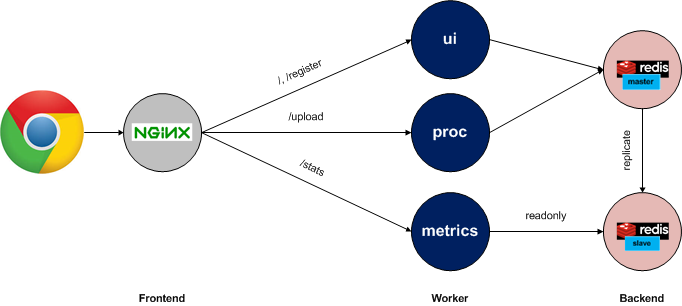

# Wordstats
For Hackathon 2016

## Architecture

As shown in the picture above, this application is front-ended
by nginx. There are 3 NodeJS-based microservices - ui, processor
and metrics - which implement all the logic of the app. nginx
dispatches requests to each of these microservices based on the
path component of the incoming URI. A backend redis deployment 
is used to store the data that the application uses. The redis
tier deploys a master and one or more slave processes. The
master process is used by those components that need to update
data and the slave processes are used to serve readonly 
requests.

### ui
This component is responsible for rendering the initial 
web interface and for identifying each user by asking them
to register their name. 

### proc
This component is the one that actually analyzes the text
submitted by the user and updates the related statistics in
the redis master

### metrics
This component simply services requests for both per-user
stats as well as global stats.

## Authentication
A session-cookie is used to identify each user. This cookie
is created and associated with a user when they register
their name. All subsequent requests from the browser will
include this cookie and all 3 components use the cookie to
identify the user. The value stored in the cookie is a 
randomly generated string.

## Redis tables
TBD - Put info about the table schema here.
